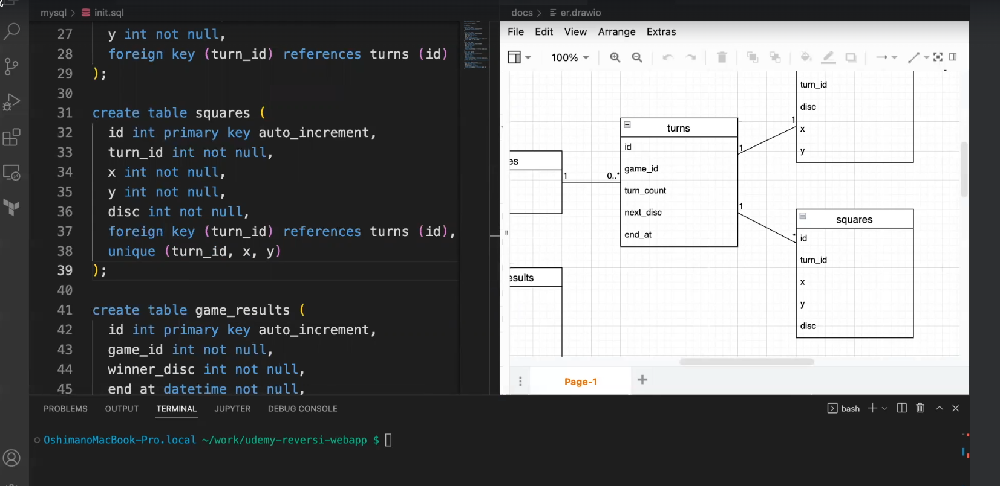
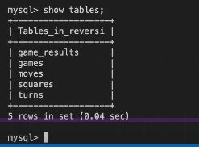

## DDL の作成

- ER 図を基に DDL を書く
- 対象ファイル　 mysql/init.sql
- 下記のように create table を作成していく
  

## DDL の実行

- ターミナルで MySQL に接続
- 下記を実行
  
- エラーが出たりした場合は、DB に接続できないといったエラーであればパスワードが間違っていたり綴りが違ったりすることがある
- DB に接続
  
- show tables を実行するとテーブル一覧が表示される
  

- DB 準備完了
