## アプリケーションアーキテクチャとは

- アーキテクチャとは建築様式などと訳される
  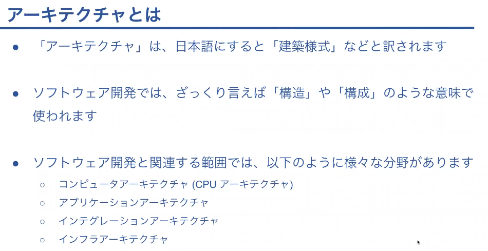

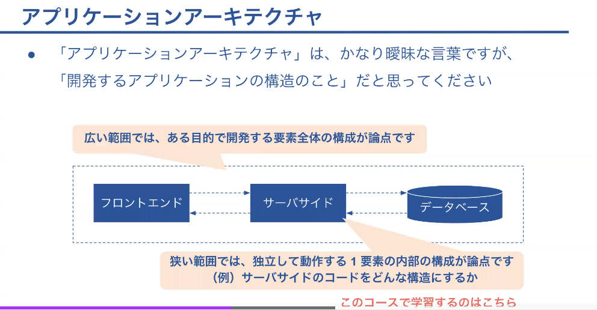

- インテグレーションアーキテクチャ
  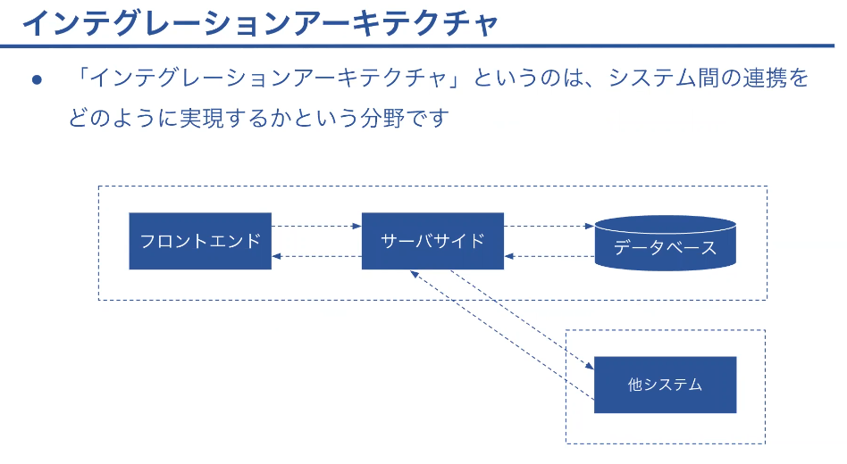

- インフラアーキテクチャ
  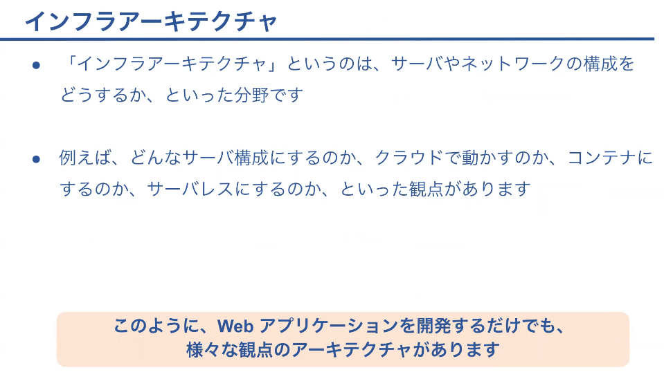

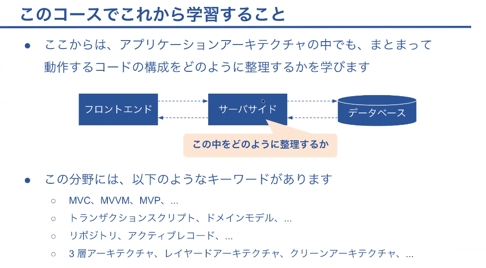

## 3 層アーキテクチャとは

- アプリケーション設計の基本
  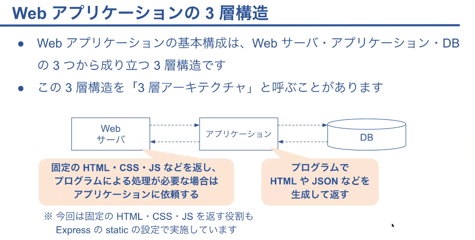

- アプリケーション内部の 3 層アーキテクチャ
  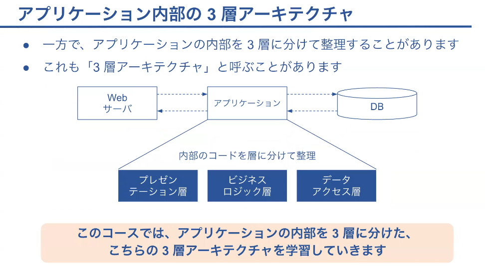

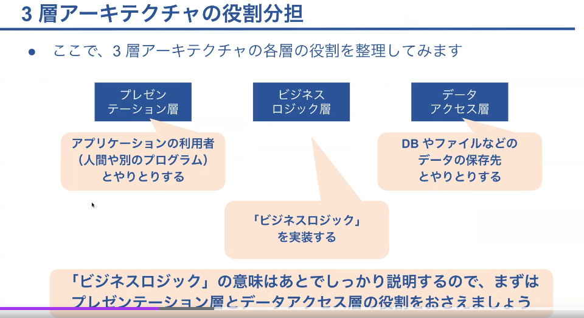

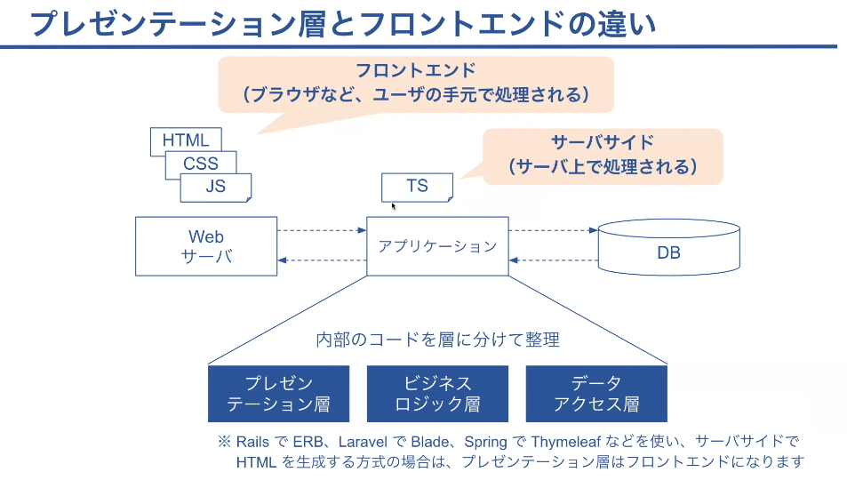

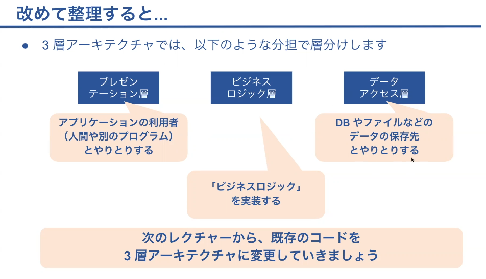

## Table Data Gateway 　パターンとは

- データアクセス層の実装
  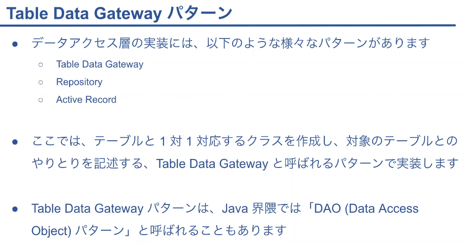

## プレゼンテーション層とは

- main.ts に API ごとに処理が書かれており、API の数が増える度に main.ts のコードが増える為、フレームワークによるがコントローラーやルーターといった機能で整理出来る

## 現時点でのアプリ構成

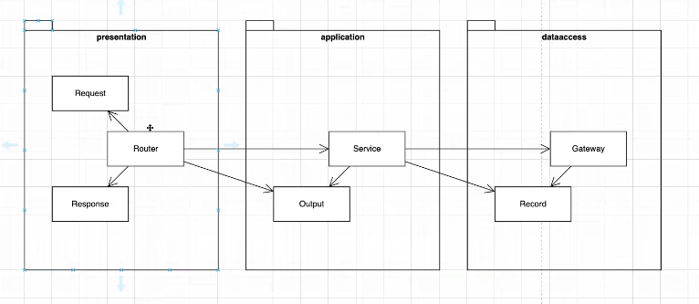

## MVC と 3 層アーキテクチャの関係

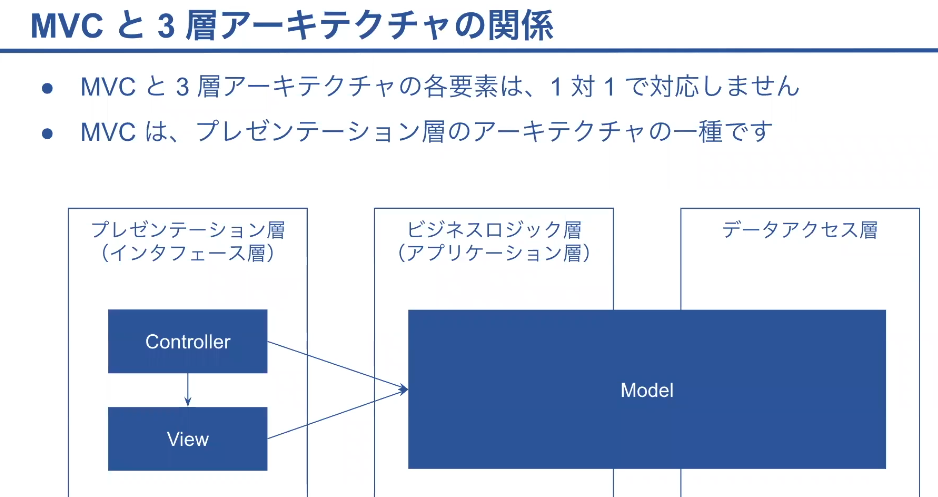

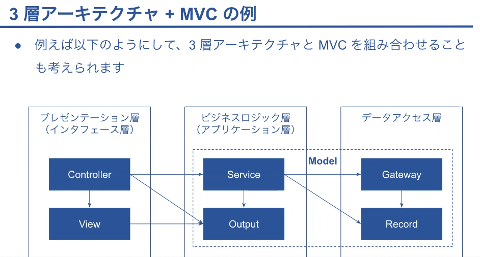

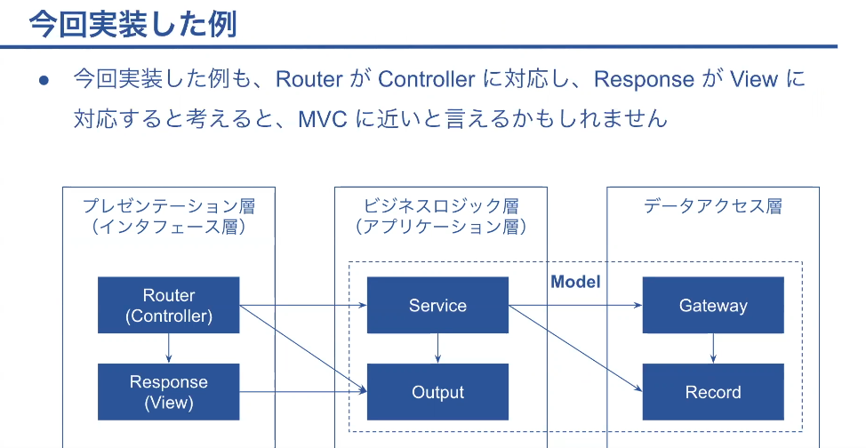

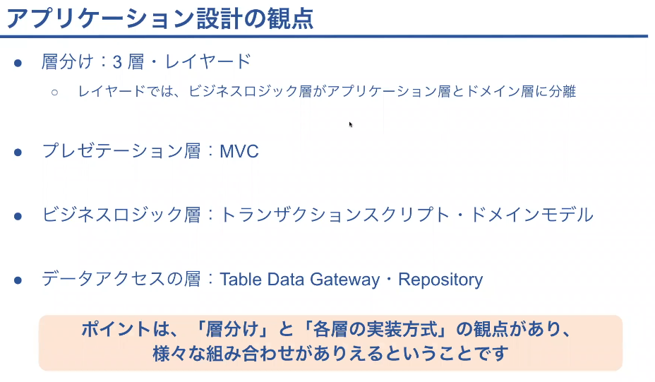

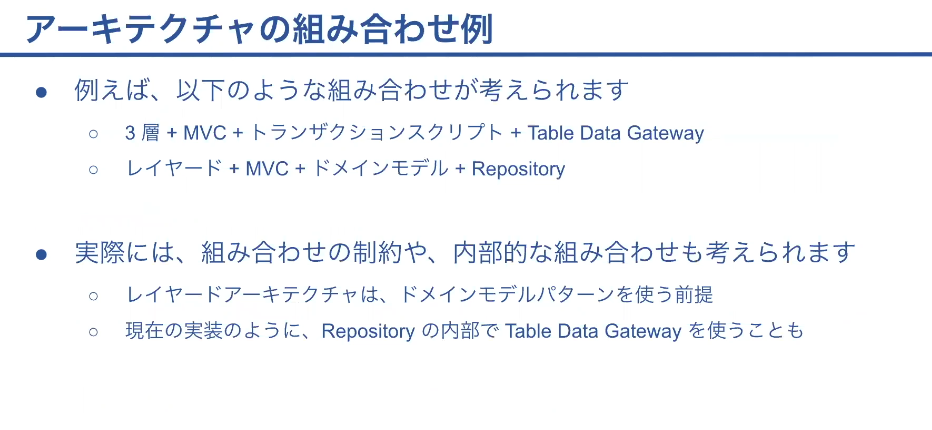

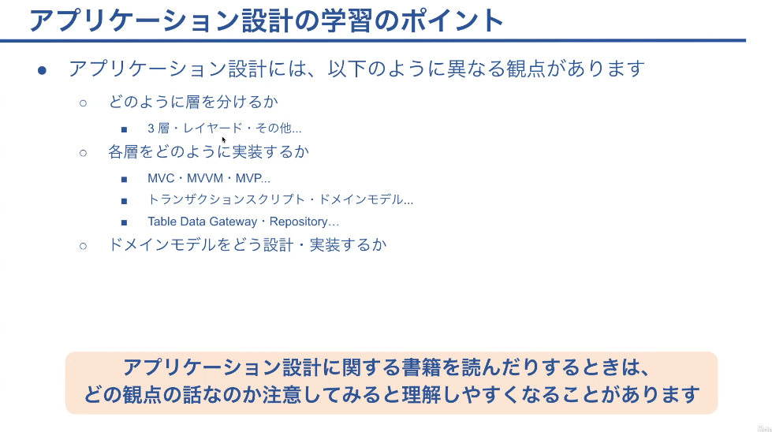
