## ビジネスロジックとは

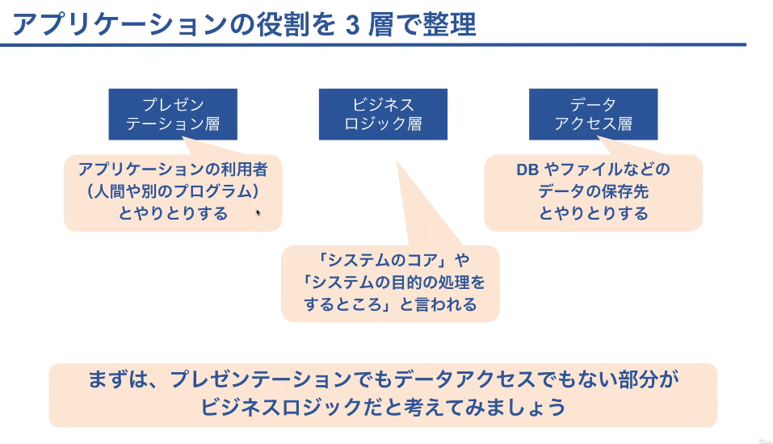

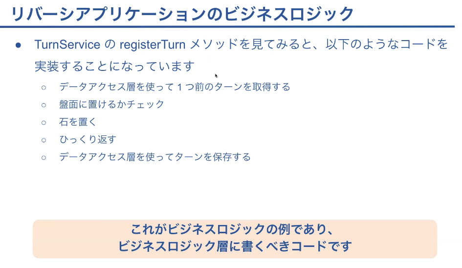

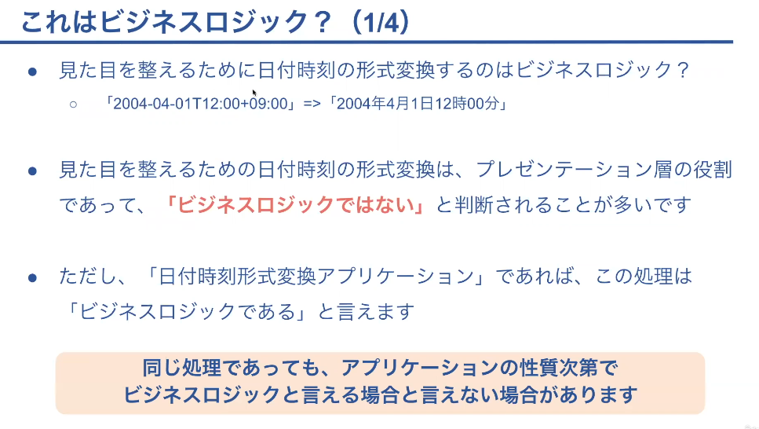

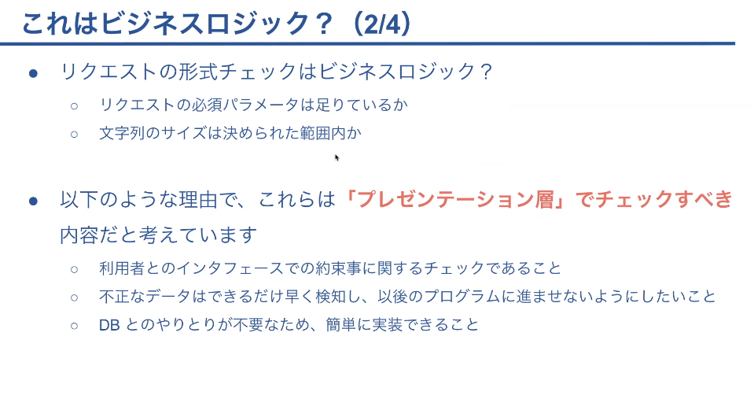

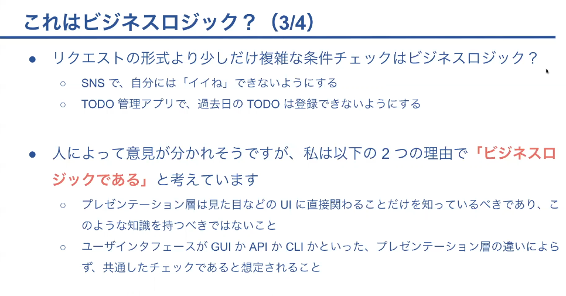

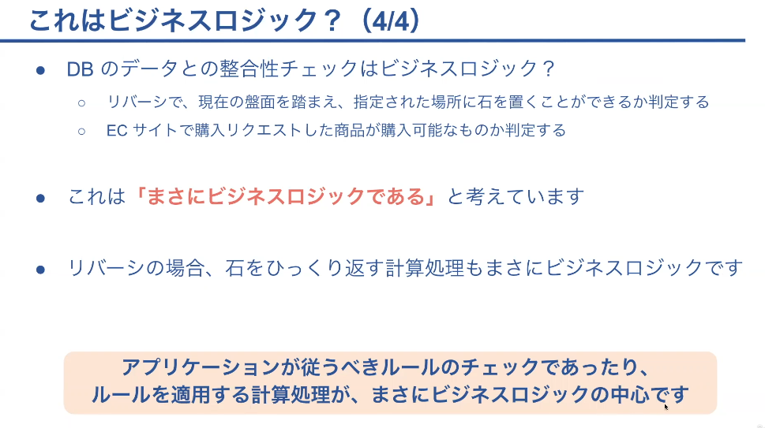

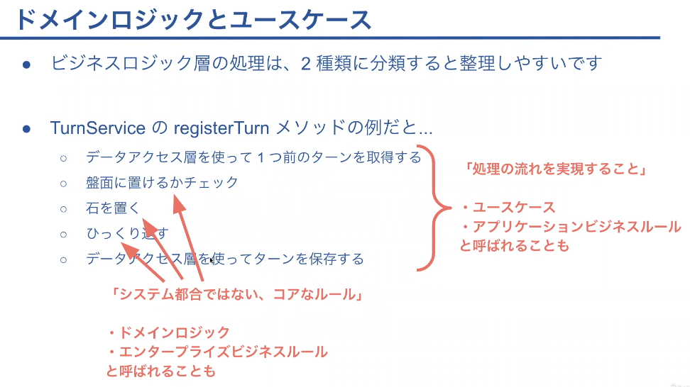

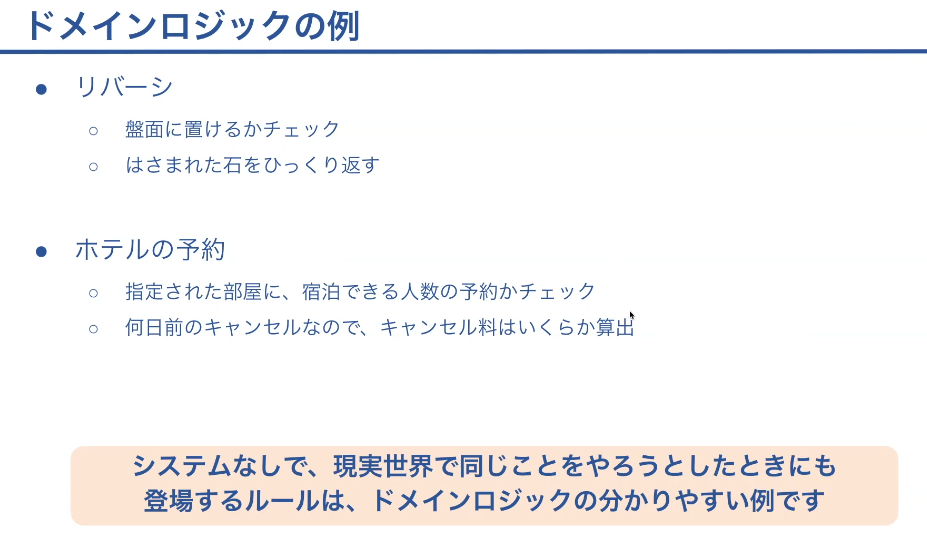

## ビジネスロジックの実装方式

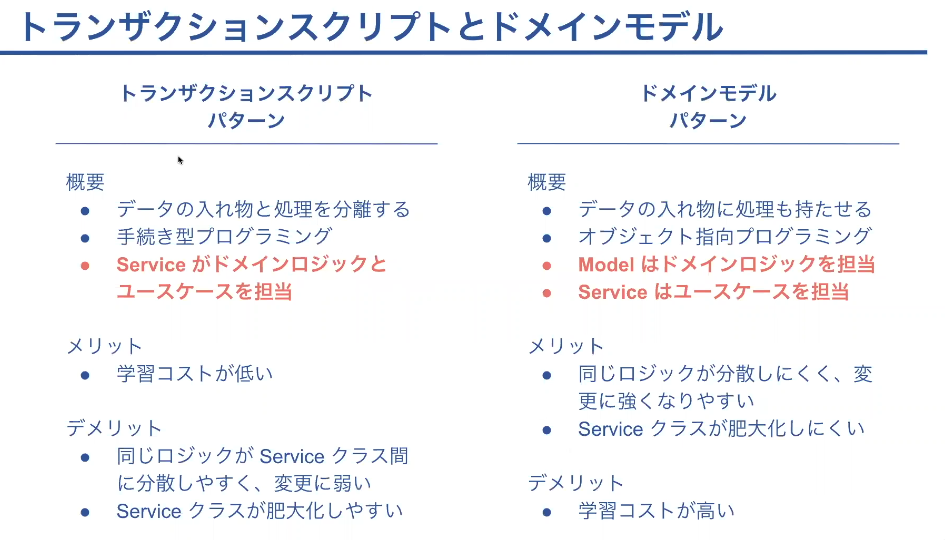

## ドメインモデルの設計

- ソース　/architecture.drawio

- ドメインモデルをまとめて扱う単位を集約と呼ぶ

## リポジトリパターン

- リポジトリパターンとはドメインモデルの形式でデータを読み書きするクラスを作成するというもの
- ドメインモデルの都合でドメインモデルのまとまった単位でデータの読み書きをする実装をリポジトリパターンという

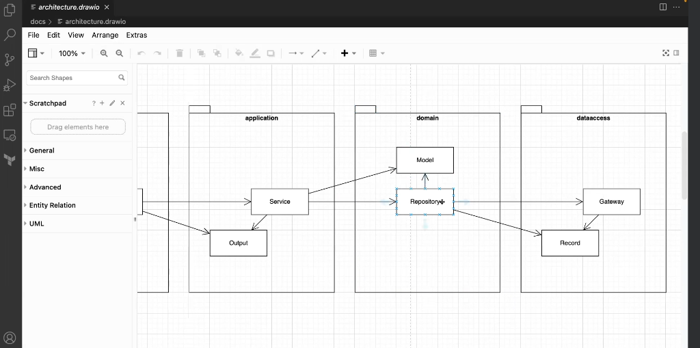

## ディレクトリ作成の方針

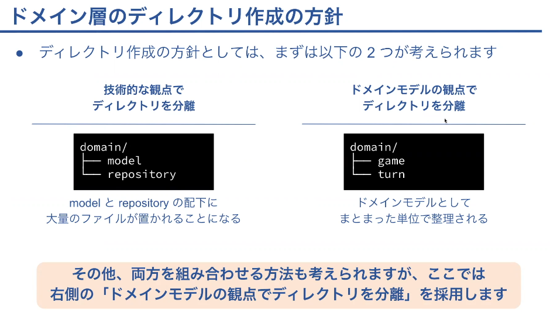
