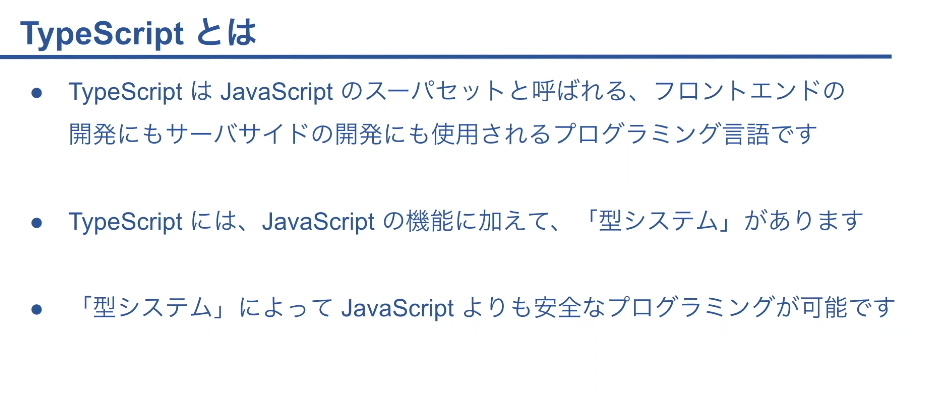
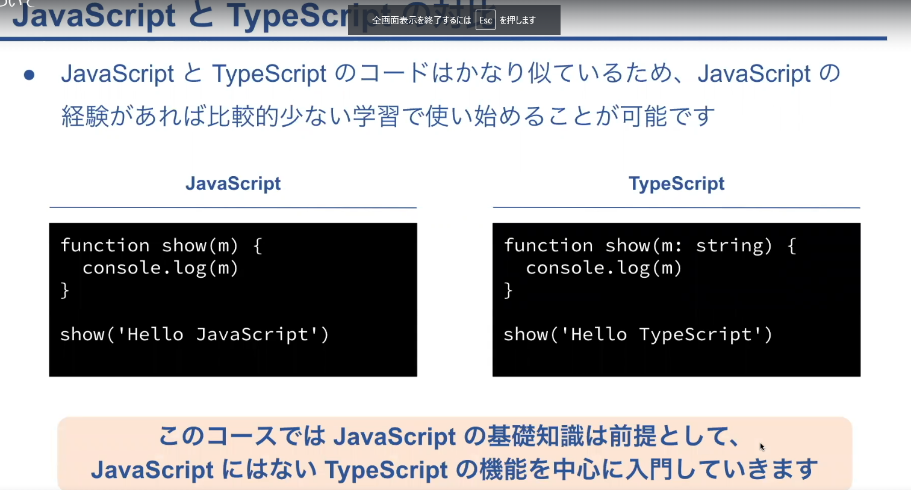
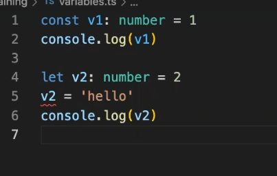
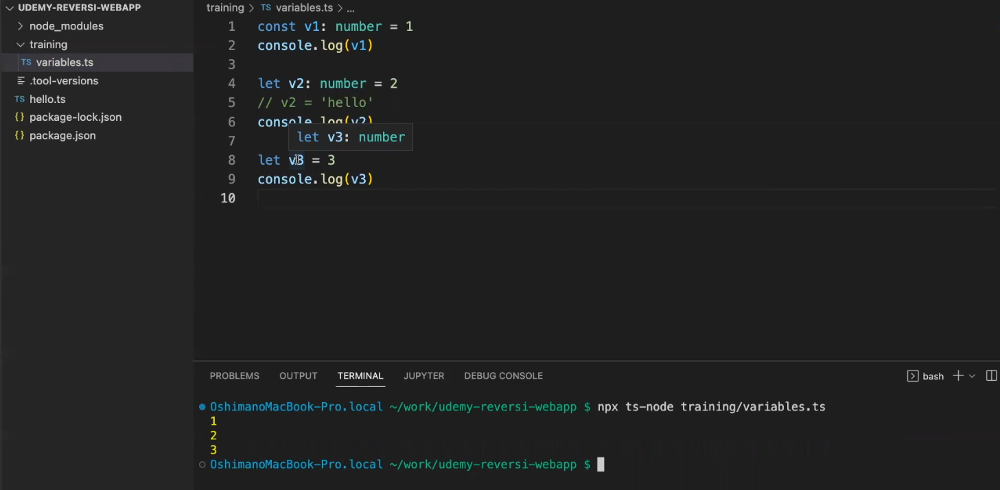
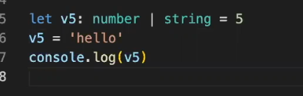
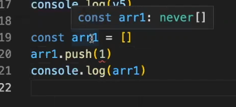
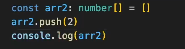

## TypeScript について

- コンパイルエラーとは

  - 下記の画像のように number と指定した変数に文字列を入れると起きるエラー
    

- 型推論とは

  - 下記の画像のように変数に 3 が代入されている状態で、Typescript が number 型だろうなと推論してくれること
    
  - 複数の型が入る可能性があるもの等は下記のように |　で定義する事が出来る
    

- 配列
  - never[]は number も string もどんな型も該当しない為、never の配列に number を追加する事が出来ない
    
  - 空の配列を用意してあとから変数を入れたい場合は下記のように number[]と記述してから配列で初期化すると変数を入れれる
    
