## 関数の基本

- any はどんな型の変数でも入れる事が出来る型になるが、画像のように変数同士を掛け算する関数があった場合、any とするとプログラムが想定外の動きを行い NaN と返すようなことになる
  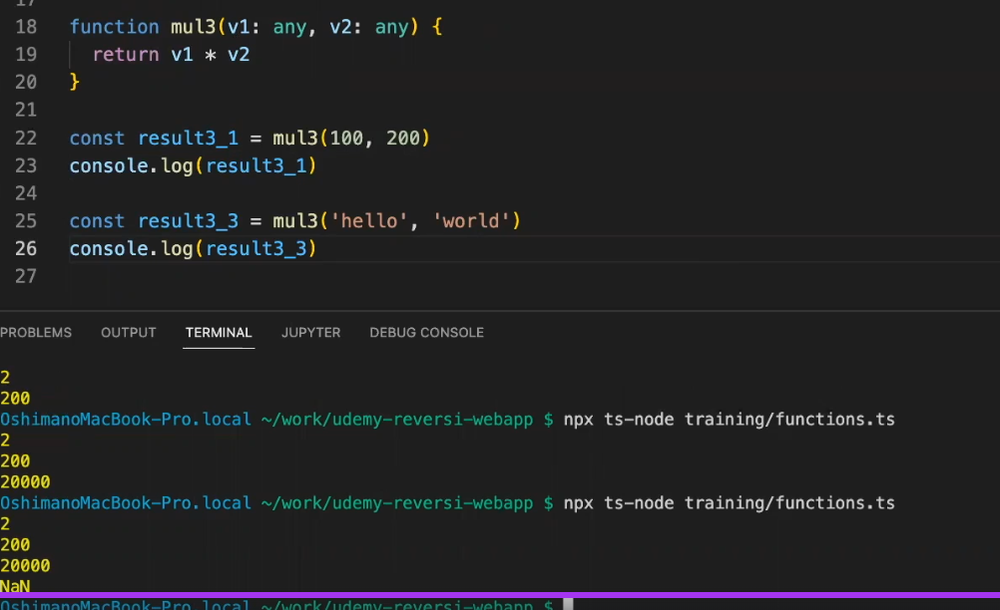

- 適切な型を指定することが大事
  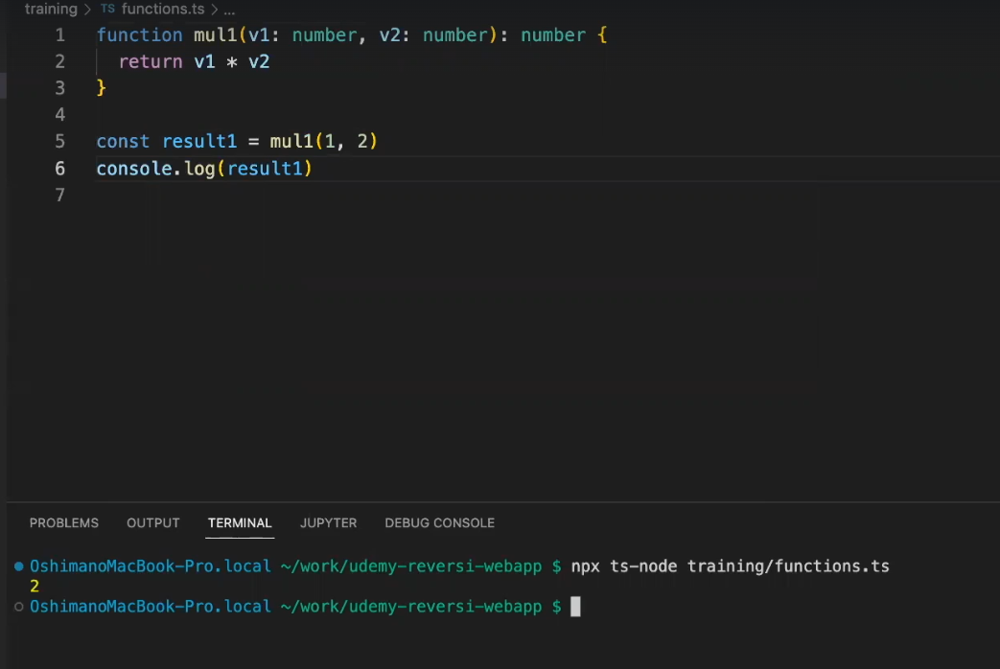

## クラス・コンストラクタ・getter

- クラスの書き方となる
- クラスの最初に書いてあるのはクラスのフィールド
- 使い方としては、const f1 = new Fraction(1,2)というふうに使う
- new でコンストラクターを呼び出してインスタンスを作ることができる
  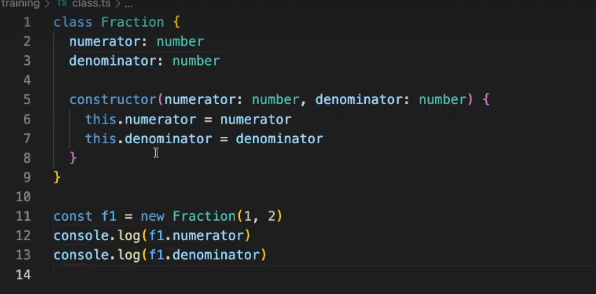

- f1.numerator = 3 とした時に実行すると 3 が表示される
  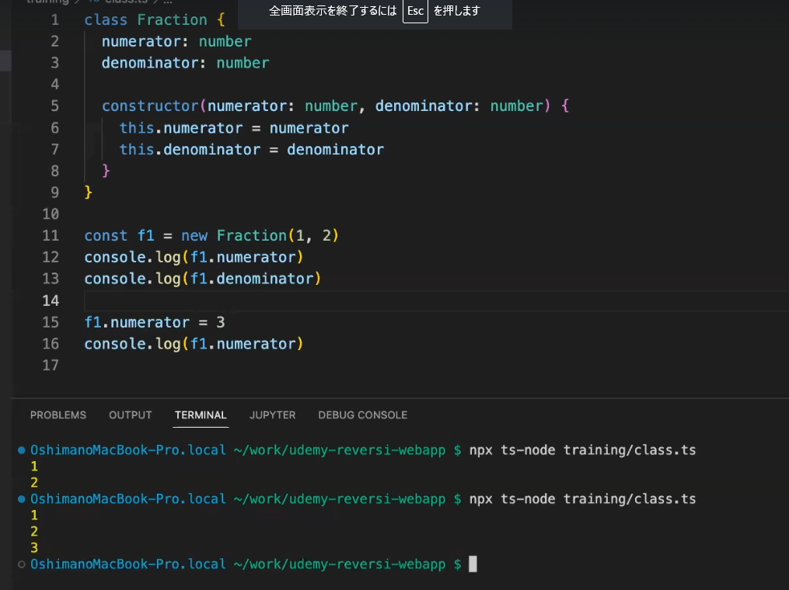

- このクラスの記述だとフィールドを後から書き換えることができる状態になり望ましくない
- 一度、定義した値を後から書き換えられないようにした方がバグの混入を防ぐ事が出来る
- 下記のようにフィールドの前に private をつけるとクラスの外部から見えなくなり、フィールドに代入するコードがエラーとなる
- フィールドはプライベートにすることが基本となる

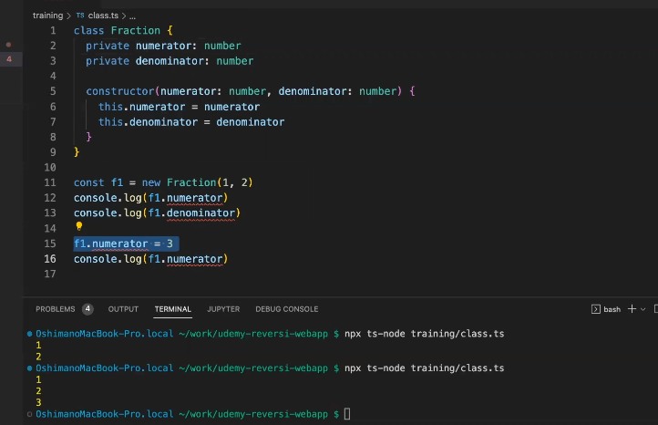

- しかしこのコードではデータを読み出す箇所もエラーになる為、値を呼び出すには getter を作る必要がある
- フィールド名の先頭に\_をつける
- 下記の画像のように記述した get numerator 等を getter と呼ぶ
- これはフィールドの値を読み出すかのように f1.numerator のようにしてリターンの内容を受け取る事が出来る

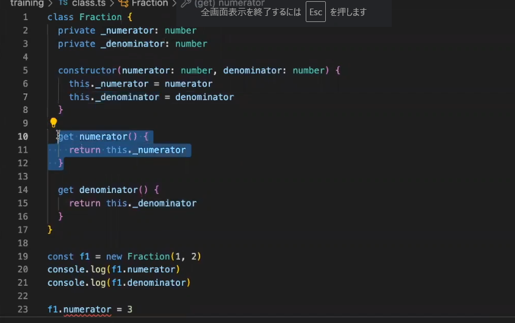

- 省略記法はフィールドを削除し private を下記画像のように記述しコンストラクターの中身も削除
  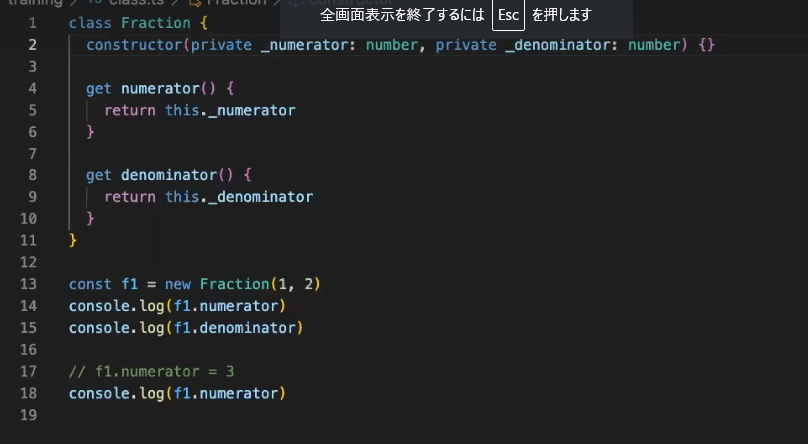

- 上記でも実行できる
- プライベートなフィールドを定義してコンストラクターで代入するようなコードが省略記法として書かれている

## クラスの機能の一つであるメソッド

- メソッドではインスタンスが持っている値フィールドを this を使って使いながら処理を行える
  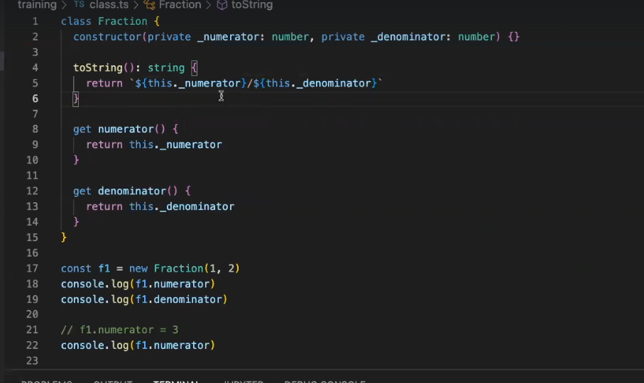
  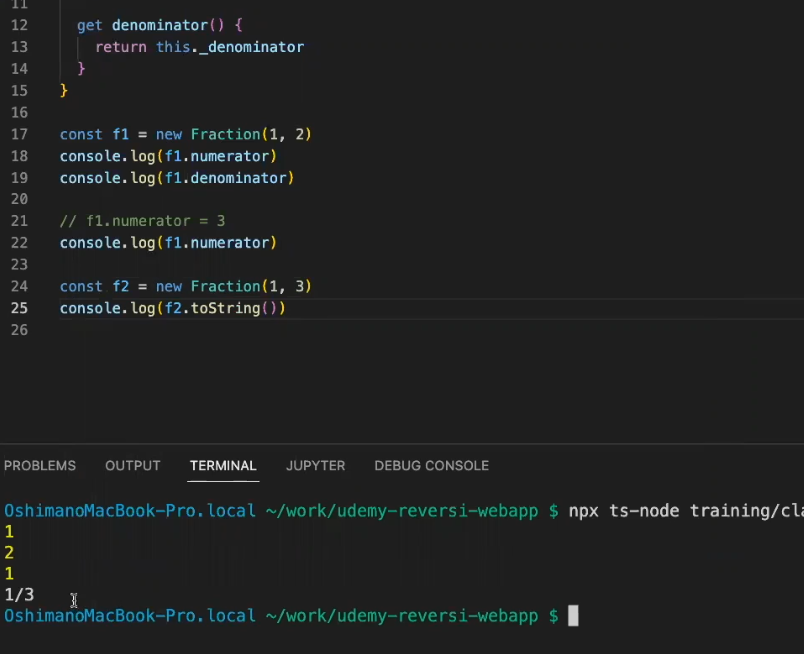
- toString で３分の 1 が表示される

- add(other:Fraction)引数として別のフラクションを受け取ってフラクションを返す add というメソッドを実装する
  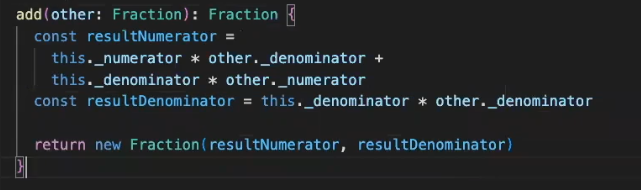
  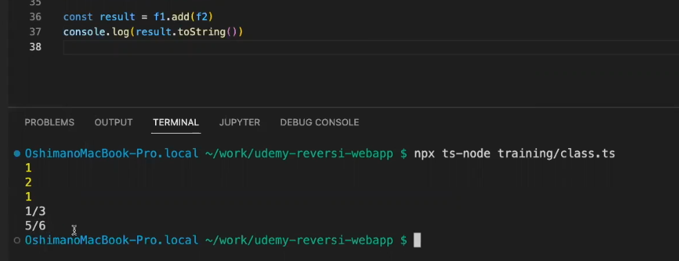

- 5/6 が表示される

## インターフェース

- コンピューターとじゃんけんするプログラムを作成しているとして下記の画像のように記述
  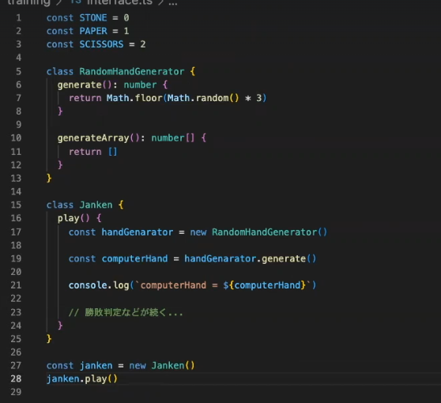
- コンピューターハンドの生成は RandomHandGenerator()のメソッドをつかっている
  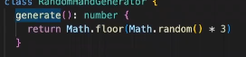

- inter face は曖昧な型のようなものを定義する事ができ、それを関数の引数や戻り値で使うことが出来る
- そうするとその箇所にはインターフェースを実装した何らかのクラスのインスタンスを入れることができる
- これを応用してインターフェースを関数の引数にしたりすることでメソッドの挙動を外部から変えたりすることができる
