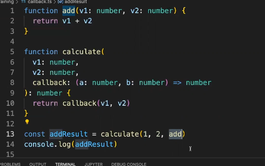

## 3 種類の方法で関数を定義する

- 通常の関数は add1
- javascript や typescript は関数を変数に代入する事が出来る
- add2 のように変数に代入された関数も通常の関数と同じように呼び出す事が出来る
- add3 は アロー関数で add2 の内容をもっと短く書くことが出来る

## 関数の callback

- コールバック関数は、一つの関数（親関数）に引数として渡され、親関数の中で特定のタイミングで呼び出される関数です。これを利用することで、非同期処理やイベントハンドリングなど、柔軟かつダイナミックなプログラムの構築が可能になります。

- Typescript の関数は別の関数の引数にするということもできる
- calculate の中に 1,2,add という関数を引数で渡している
- calculate という関数の中では v1v2 に続いて 3 つ目に callback という引数を受け取っている
  

- javascript や typescript では関数に渡したいコールバックを引数の箇所に直接書くことがよくある

- callback を使った配列の操作
- forEach などのコールバックでは、第二引数を用意するとループの何番目かというのを表すインデックスが表示される
  

- 配列の各要素を変換して別の配列を作りたいという時は map 関数を使用する
- 

- 配列の一部の要素だけを取り出したいときは filter を使用する
- 下記は偶数のユーザー一覧をフィルターしたものとなる
  
- 上記の省略
  

- 最初に定義した numbers の合計を計算する
- reduce というのは配列からコールバックの操作をした結果、１個の値を得るという意味の関数
- reduce にはコールバック関数と 0 を引数で渡しており reduce は第二引数の値を返し値として順に配列の値を current に与えて、それまでの合計値と current に対して処理を行う
- 計算を順番に行っている
  

## 非同期処理とは

- readFile に渡しているコールバック関数はその場で実行されるわけではなくファイルの読み込みが終わったら呼び出してくださいと登録しているイメージ
- コードの実行(処理)が進んでいる時に、別の処理を行う事を非同期処理という

## async await

- async をつけた関数の中では await を使うことができ、promise を返す関数が終了するのを待ってデータを取り出してから次の行動に進む
  
