## 仕様検討の進め方

- 5 つの図表を基に作成
  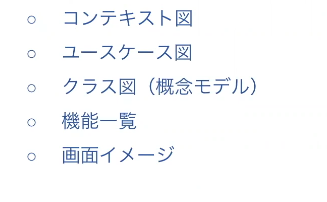

## コンテキスト図

- より大きなシステムを作るときは、どこまでを今回の開発範囲にするのかというのを明確にすることがとても重要
- 連携するシステムや使う利用者を明確にすることも非常に有用
- コンテキスト図はそういったことを洗い出しやすいので、開発の最初に作るととても話がスムーズになる
  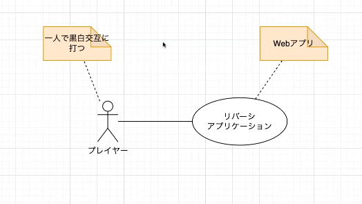

## ユースケース図

- 差異は継承を使用して表す

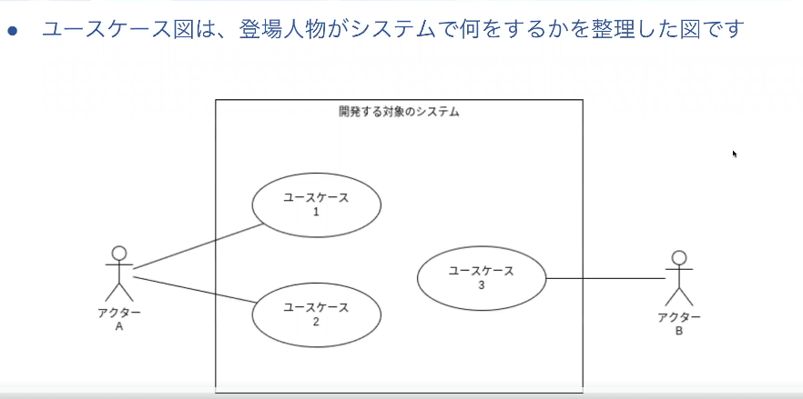

- 実装する範囲を枠で囲うと機能の範囲を明確に出きる

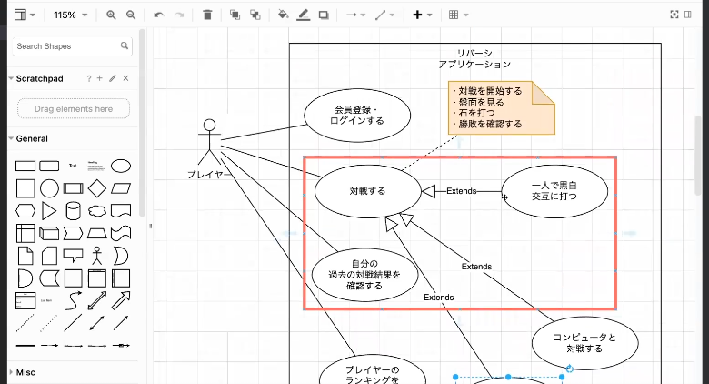

## クラス図(概念の整理)

- ユースケース図を基に整理すると良い

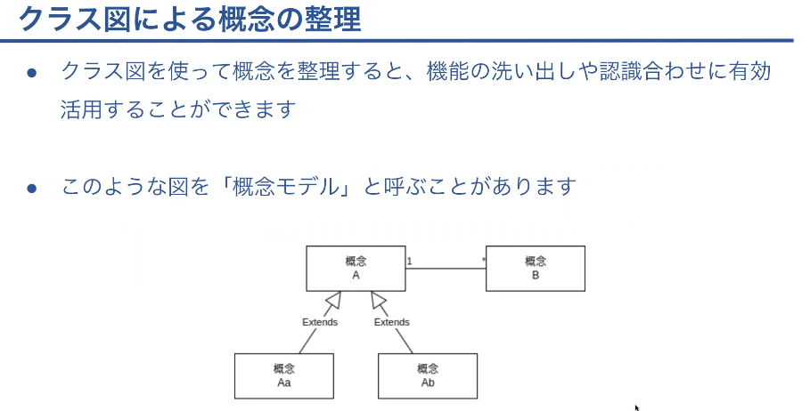

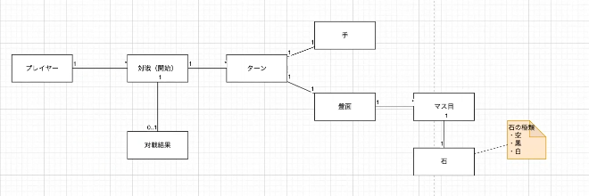

## 実装する機能の整理

- 機能の一覧を Markdown で書き出す
- クラス図を基に実装する機能を整理する
  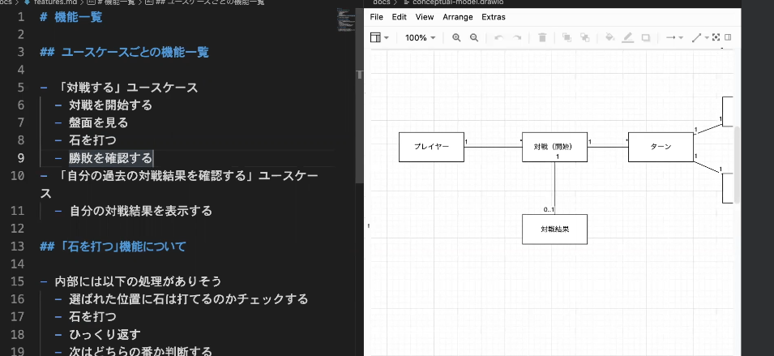

## 画面イメージの作成

- 機能整理を基に画面イメージを作成する
  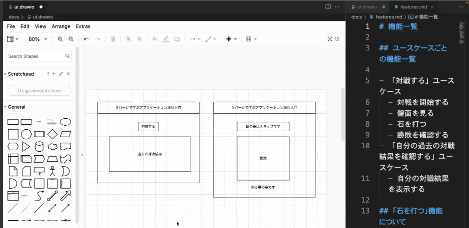

## 技術要素の選定

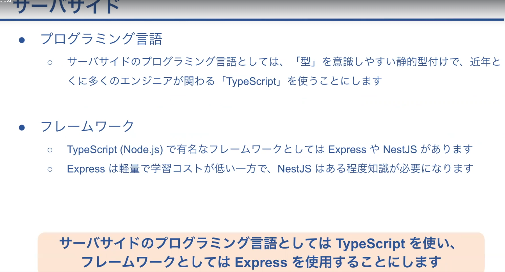

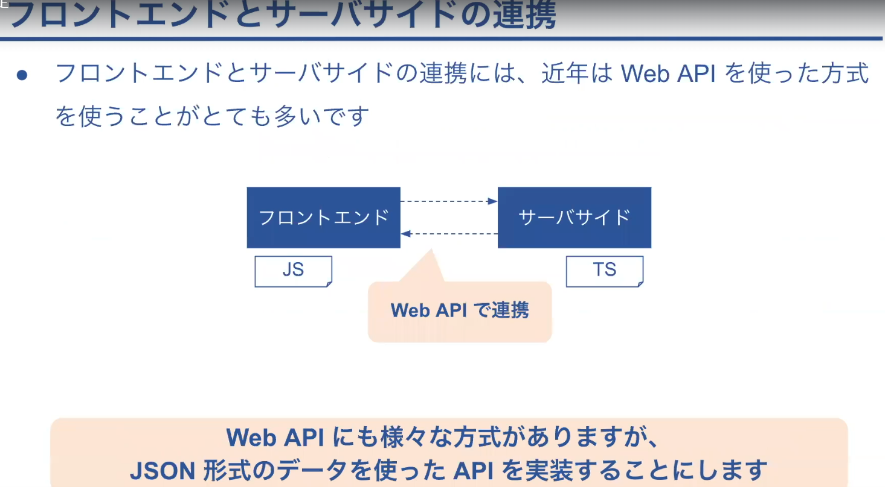

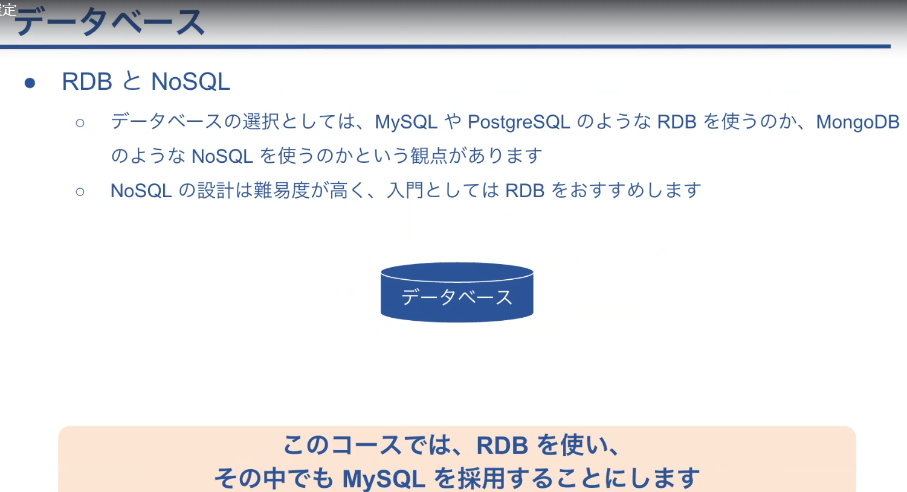

- まとめ

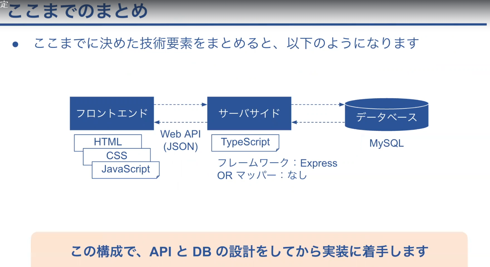
