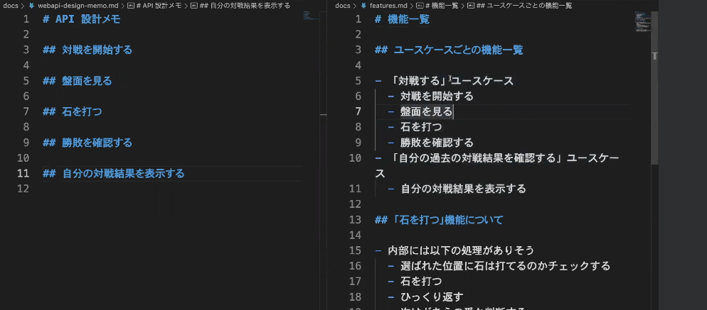
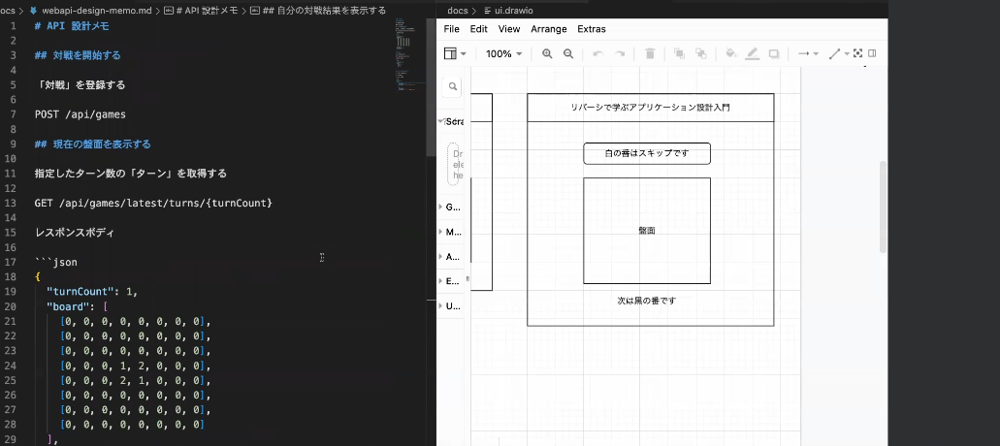
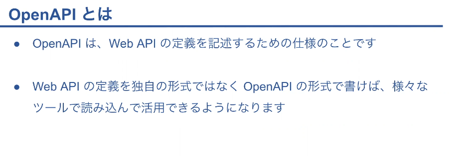
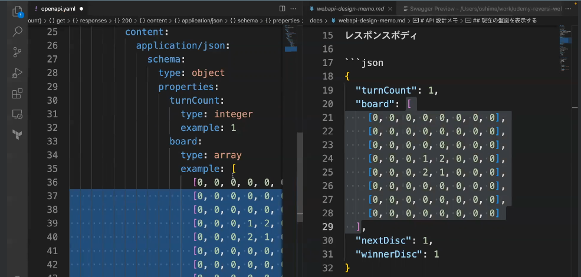
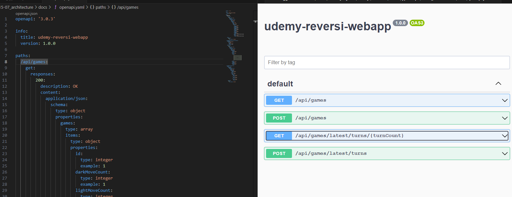

## API 設計

- 機能一覧から API 設計を作成
  

- 参照ファイル
- webapi-design-memo.md

## OpenAPI の記述

- OpenAPI は WebAPI の定義を記述するための仕様

- yaml ファイルはインデントを合わせることも重要となる
  

- Swagger Viewer というライブラリをインストールし Alt+Shift+P で内容をわかりやすく見る事が出来る
  

- オープン API の形式を使うことで、API の定義を明確に記述することができ、ツールで読み込んだりできることが分かる
