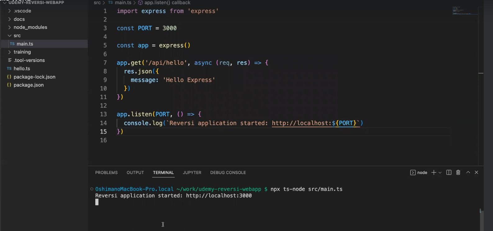
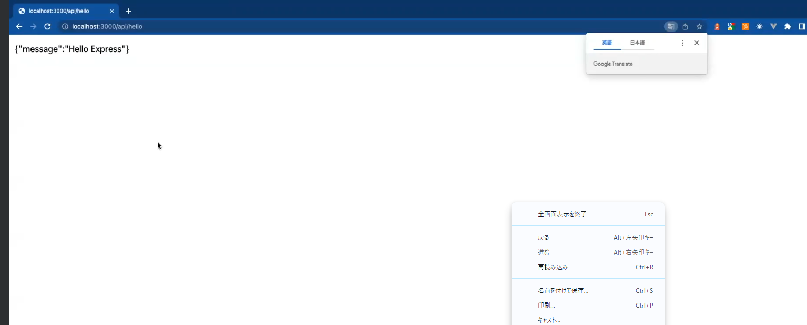
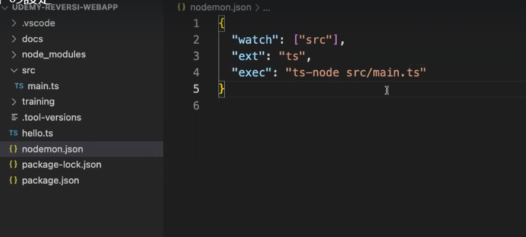
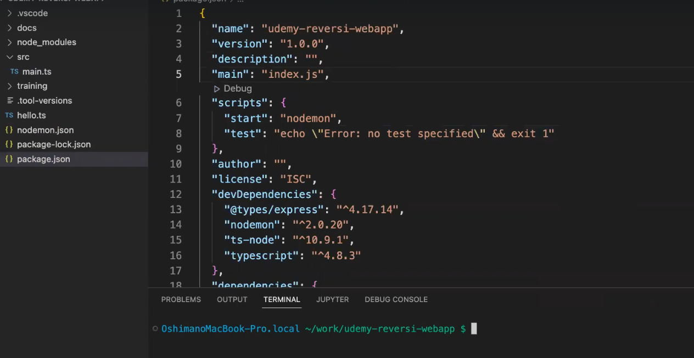
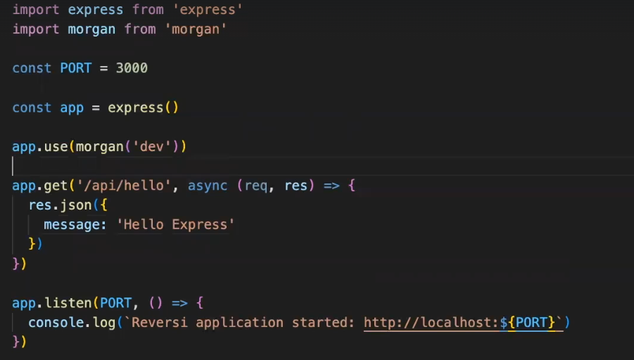
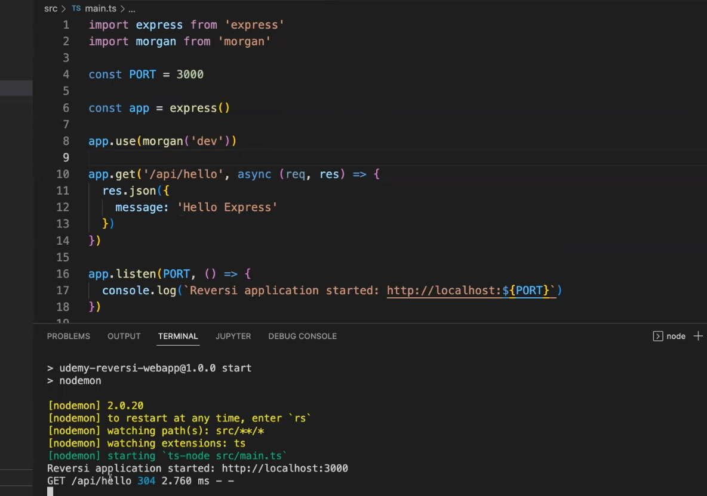

## Express について

- インストール

```

npm install express@4.18.1

npm install --save-dev @types/express@4.17.14

```

- インストール後、src フォルダを作成し main.ts を作成しコードを記述
  

- 下記画像のように表示されれば完了
  

## ホットリロードの設定

```
npm install --save-dev nodemon@2.0.20
```




- npmstart で動作確認できれば完了

## アクセスログの設定

- 実践的なアプリケーションではいつどんなアクセスがあったのかしっかり出力するべき
- Express は morgan というライブラリを使用する事で確認できる

```
npm install morgan@1.10.0

npm install --save-dev @tyoes/morgan@1.9.3
```

- main.ts に設定を追加
  

- ログ出力画面
  

## エラーハンドリングの設定

- エラーハンドリングとは、何らかの例外が発生するとアプリケーションが止まってしまうようになっている為、エラーが発生しても Web アプリ全体がクラッシュするのではなく、そのリクエストに対してだけエラーを返すようにする

- インストール

```
npm install express-async-errors@3.1.1
```

- main.ts に設定を記述
