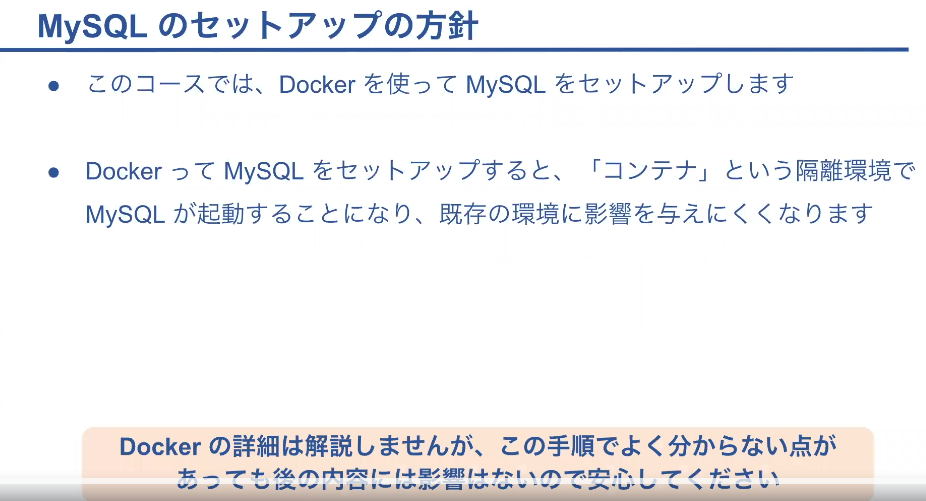
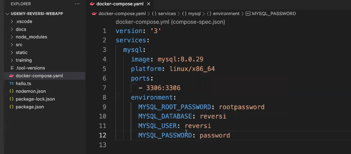
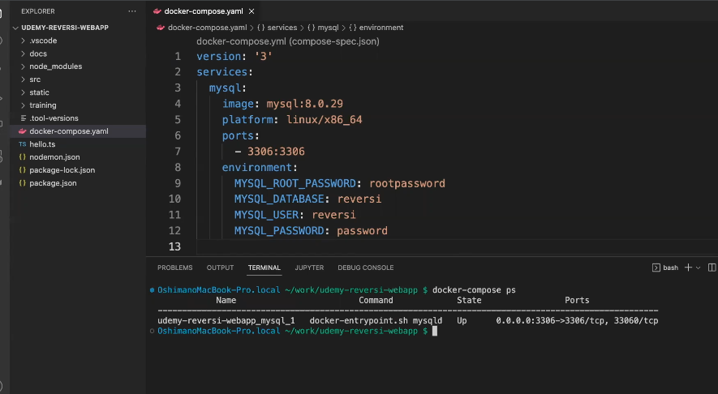
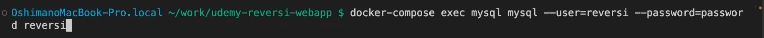
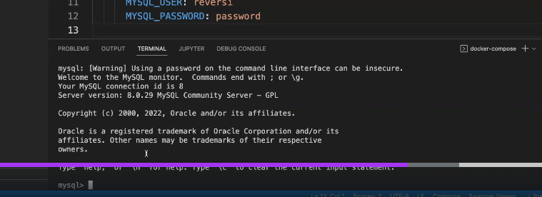
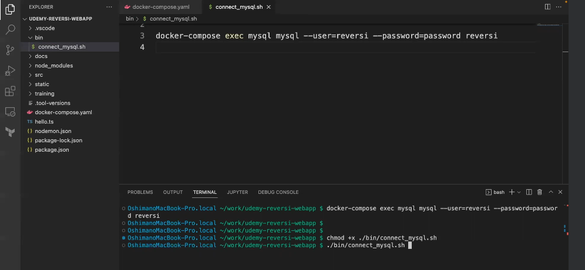

## Docker で MySQL をセットアップ



- Mysql にアクセスするためのユーザー名やパスワードを設定したり通信ポートの設定をしている
  

```
docker-compose up -d

## windowsはコマンドが違う可能性あり
```

- 上記コマンドで実行

- MySQL のコンテナが立ち上がる為、下記コマンドを実施すると MySQL のコンテナの起動状態を確認できる



- 起動した MySQL に接続する
  

- このように MySQL のプロンプトが返ってくれば OK
  

## シェルスクリプト

- 長いコマンドを短縮できるようになる
  

## MySQL のコンテナを削除する方法

- 下記のコマンドで削除できる

```
docker-compose down
```
